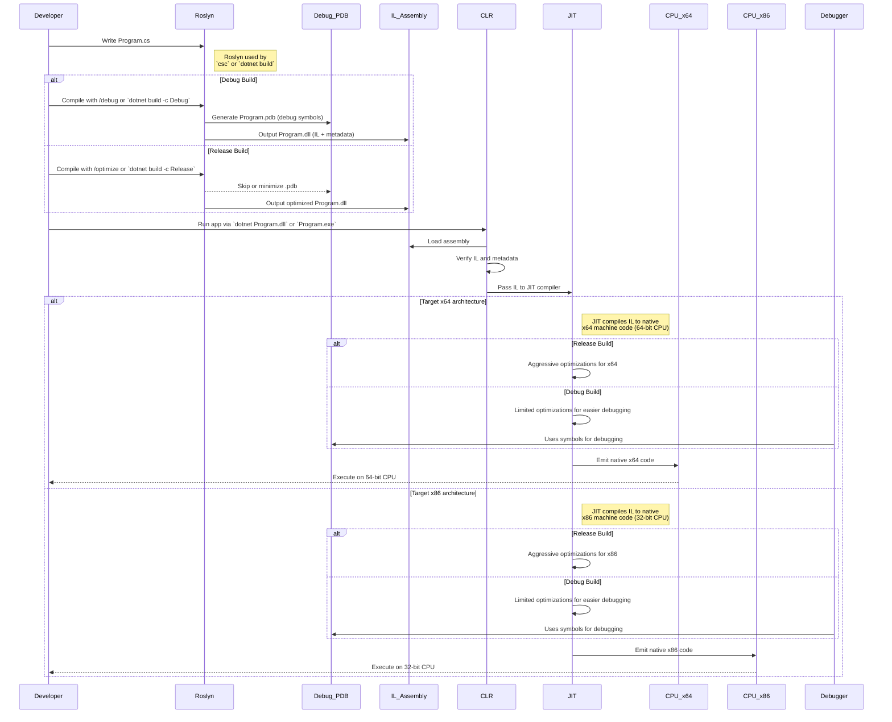

# 001.001 What is C#?

## C# in a Nutshell

- **Type-safe**, **object-oriented** language by Microsoft

## Quick Facts
→ Created by **Anders Hejlsberg** (2000)  
→ Current version: **C# 12** (2023)  
→ Compiles to **IL** (Intermediate Language)  
→ Runs on **CLR** (Common Language Runtime)

